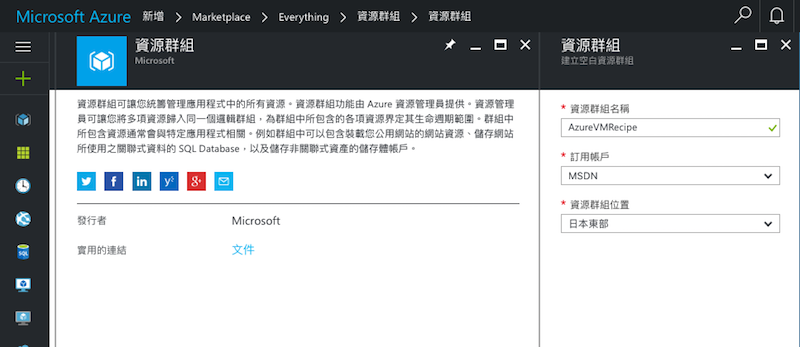
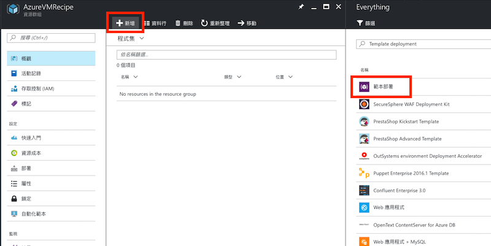
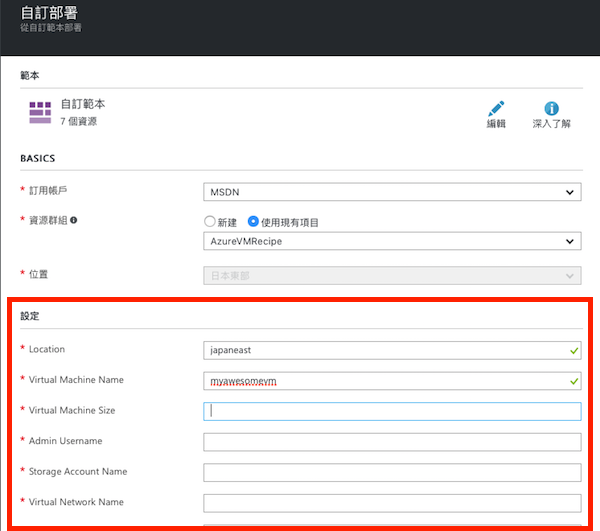
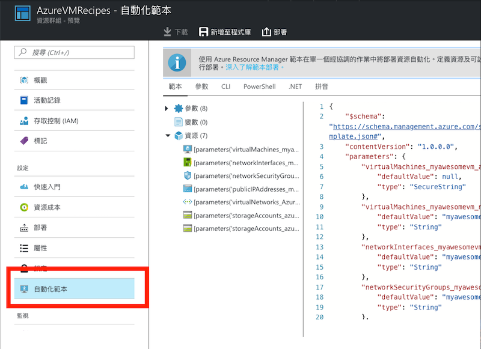

# 使用 ARM 範本部署新虛擬機器

_作者: Eric ShangKuan @ericsk_

Microsoft Azure 目前是使用 _[資源管理員 (Resource Manager)](https://docs.microsoft.com/zh-tw/azure/azure-resource-manager/resource-group-overview)_ 模式來組織與管理在 Microsoft Azure 上建立的服務及資源，舉例來說，當你在 Microsoft Azure 上建立虛擬機器時，除了虛擬機器的資源外，還會產生像是 Azure 儲存體、虛擬網路、公用 IP 位址等資源，這些資源會一併放進同一個 _資源群組（resource group）_ 裡，除了群組化管理之外，還可以做到角色存取控制（RBAC, Role-based Access Control）、運用宣告式語法描述資源等功能。

而 _Azure Resource Manager templates (ARM 範本)_ 就是以宣告式語法描述資源的文件（以 JSON 檔案格式呈現），你可以直接拿這個範本來部署多項資源，而不必一行一行指令來產生。

> 即使是在 Web 管理界面或是命令列工具產生的資源，都可以再匯出 ARM 範本另外做部署。

## 編寫 ARM 範本

一個基本的 ARM 範本結構如下：

```json
{
    "$schema": "http://schema.management.azure.com/schemas/2015-01-01/deploymentTemplate.json#",
    "contentVersion": "",
    "parameters": {  },
    "variables": {  },
    "resources": [  ],
    "outputs": {  }
}
```

定義分別如下：

* **$schema** 描述 ARM 範本的文件結構定義，基本上目前都直接使用 `http://schema.management.azure.com/schemas/2015-01-01/deploymentTemplate.json#` 這個 URL。

* **contentVersion** 定義這個範本的版本，你可以根據自己的需求填寫。

* **parameters** 將資源的某些資訊（例如：名稱、定價方案等）定義為參數，可以另外讀入參數檔案來置換內容。

* **variables** 可以定義一些變數（可描配運算語法）來使用。

* **resources** 主要描述資源的部份，資源以 JSON 物件的格式放入這個陣列之中。一個資源的基本格式大概像是這樣：

    ```json
    {
        "name": 資源名稱,
        "type": 資源類別,
        "apiVersion": 資源描述語法的版本,
        "location": 部署機房位置,
        "dependsOn": 相依的資源（建立前必須存在的資源）,
        "properties": {
            // 定義資源細部資料
        }
    }
    ```

* **outputs** 完成部署後要回傳的資料內容。

以下是一個基本虛擬機器的 ARM 範本範例內容：

```json
{
    "$schema": "http://schema.management.azure.com/schemas/2015-01-01/deploymentTemplate.json#",
    "contentVersion": "1.0.0.0",
    "parameters": {
        "location": {
            "type": "string"
        },
        "virtualMachineName": {
            "type": "string"
        },
        "virtualMachineSize": {
            "type": "string"
        },
        "adminUsername": {
            "type": "string"
        },
        "storageAccountName": {
            "type": "string"
        },
        "virtualNetworkName": {
            "type": "string"
        },
        "networkInterfaceName": {
            "type": "string"
        },
        "networkSecurityGroupName": {
            "type": "string"
        },
        "adminPublicKey": {
            "type": "string"
        },
        "storageAccountType": {
            "type": "string"
        },
        "diagnosticsStorageAccountName": {
            "type": "string"
        },
        "diagnosticsStorageAccountId": {
            "type": "string"
        },
        "diagnosticsStorageAccountType": {
            "type": "string"
        },
        "addressPrefix": {
            "type": "string"
        },
        "subnetName": {
            "type": "string"
        },
        "subnetPrefix": {
            "type": "string"
        },
        "publicIpAddressName": {
            "type": "string"
        },
        "publicIpAddressType": {
            "type": "string"
        }
    },
    "variables": {
        "vnetId": "[resourceId('AzureVMRecipes','Microsoft.Network/virtualNetworks', parameters('virtualNetworkName'))]",
        "subnetRef": "[concat(variables('vnetId'), '/subnets/', parameters('subnetName'))]"
    },
    "resources": [
        {
            "name": "[parameters('virtualMachineName')]",
            "type": "Microsoft.Compute/virtualMachines",
            "apiVersion": "2015-06-15",
            "location": "[parameters('location')]",
            "dependsOn": [
                "[concat('Microsoft.Network/networkInterfaces/', parameters('networkInterfaceName'))]",
                "[concat('Microsoft.Storage/storageAccounts/', parameters('storageAccountName'))]",
                "[concat('Microsoft.Storage/storageAccounts/', parameters('diagnosticsStorageAccountName'))]"
            ],
            "properties": {
                "osProfile": {
                    "computerName": "[parameters('virtualMachineName')]",
                    "adminUsername": "[parameters('adminUsername')]",
                    "linuxConfiguration": {
                        "disablePasswordAuthentication": "true",
                        "ssh": {
                            "publicKeys": [
                                {
                                    "path": "[concat('/home/', parameters('adminUsername'), '/.ssh/authorized_keys')]",
                                    "keyData": "[parameters('adminPublicKey')]"
                                }
                            ]
                        }
                    }
                },
                "hardwareProfile": {
                    "vmSize": "[parameters('virtualMachineSize')]"
                },
                "storageProfile": {
                    "imageReference": {
                        "publisher": "Canonical",
                        "offer": "UbuntuServer",
                        "sku": "16.04.0-LTS",
                        "version": "latest"
                    },
                    "osDisk": {
                        "name": "[parameters('virtualMachineName')]",
                        "createOption": "fromImage",
                        "vhd": {
                            "uri": "[concat(concat(reference(resourceId('AzureVMRecipes', 'Microsoft.Storage/storageAccounts', parameters('storageAccountName')), '2015-06-15').primaryEndpoints['blob'], 'vhds/'), parameters('virtualMachineName'), '20170106160737.vhd')]"
                        }
                    },
                    "dataDisks": []
                },
                "networkProfile": {
                    "networkInterfaces": [
                        {
                            "id": "[resourceId('Microsoft.Network/networkInterfaces', parameters('networkInterfaceName'))]"
                        }
                    ]
                },
                "diagnosticsProfile": {
                    "bootDiagnostics": {
                        "enabled": true,
                        "storageUri": "[reference(resourceId('AzureVMRecipes', 'Microsoft.Storage/storageAccounts', parameters('diagnosticsStorageAccountName')), '2015-06-15').primaryEndpoints['blob']]"
                    }
                }
            }
        },
        {
            "name": "[parameters('storageAccountName')]",
            "type": "Microsoft.Storage/storageAccounts",
            "apiVersion": "2015-06-15",
            "location": "[parameters('location')]",
            "properties": {
                "accountType": "[parameters('storageAccountType')]"
            }
        },
        {
            "name": "[parameters('diagnosticsStorageAccountName')]",
            "type": "Microsoft.Storage/storageAccounts",
            "apiVersion": "2015-06-15",
            "location": "[parameters('location')]",
            "properties": {
                "accountType": "[parameters('diagnosticsStorageAccountType')]"
            }
        },
        {
            "name": "[parameters('virtualNetworkName')]",
            "type": "Microsoft.Network/virtualNetworks",
            "apiVersion": "2016-09-01",
            "location": "[parameters('location')]",
            "properties": {
                "addressSpace": {
                    "addressPrefixes": [
                        "[parameters('addressPrefix')]"
                    ]
                },
                "subnets": [
                    {
                        "name": "[parameters('subnetName')]",
                        "properties": {
                            "addressPrefix": "[parameters('subnetPrefix')]"
                        }
                    }
                ]
            }
        },
        {
            "name": "[parameters('networkInterfaceName')]",
            "type": "Microsoft.Network/networkInterfaces",
            "apiVersion": "2016-09-01",
            "location": "[parameters('location')]",
            "dependsOn": [
                "[concat('Microsoft.Network/virtualNetworks/', parameters('virtualNetworkName'))]",
                "[concat('Microsoft.Network/publicIpAddresses/', parameters('publicIpAddressName'))]",
                "[concat('Microsoft.Network/networkSecurityGroups/', parameters('networkSecurityGroupName'))]"
            ],
            "properties": {
                "ipConfigurations": [
                    {
                        "name": "ipconfig1",
                        "properties": {
                            "subnet": {
                                "id": "[variables('subnetRef')]"
                            },
                            "privateIPAllocationMethod": "Dynamic",
                            "publicIpAddress": {
                                "id": "[resourceId('AzureVMRecipes','Microsoft.Network/publicIpAddresses', parameters('publicIpAddressName'))]"
                            }
                        }
                    }
                ],
                "networkSecurityGroup": {
                    "id": "[resourceId('AzureVMRecipes', 'Microsoft.Network/networkSecurityGroups', parameters('networkSecurityGroupName'))]"
                }
            }
        },
        {
            "name": "[parameters('publicIpAddressName')]",
            "type": "Microsoft.Network/publicIpAddresses",
            "apiVersion": "2016-09-01",
            "location": "[parameters('location')]",
            "properties": {
                "publicIpAllocationMethod": "[parameters('publicIpAddressType')]"
            }
        },
        {
            "name": "[parameters('networkSecurityGroupName')]",
            "type": "Microsoft.Network/networkSecurityGroups",
            "apiVersion": "2016-09-01",
            "location": "[parameters('location')]",
            "properties": {
                "securityRules": [
                    {
                        "name": "default-allow-ssh",
                        "properties": {
                            "priority": 1000,
                            "sourceAddressPrefix": "*",
                            "protocol": "TCP",
                            "destinationPortRange": "22",
                            "access": "Allow",
                            "direction": "Inbound",
                            "sourcePortRange": "*",
                            "destinationAddressPrefix": "*"
                        }
                    }
                ]
            }
        }
    ],
    "outputs": {
        "adminUsername": {
            "type": "string",
            "value": "[parameters('adminUsername')]"
        }
    }
}
```

從這個範例，我們可以大約學習到如何編寫一個完整的 ARM 範本，像是：

* **parameters** 這個部份像是 _location_、 _virtualMachineName_ 這些讓用戶自行決定數值的部份就定義在參數這個區域，而在部署時就能另外傳入參數檔案（通常是 `parameters.json` 檔案）來替換內容。

* **variables** 這裡定義了 `vnetId` 及 `subnetRef` 兩個變數，這些變數的值就使用了[範本函式](https://docs.microsoft.com/zh-tw/azure/azure-resource-manager/resource-group-template-functions)來做運算。

* **resources** 這裡定義了像是虛擬機器、虛擬網路、儲存體等資源，然後依照不同的資源類別填入不同的屬性（properties）值。

* **output** 就只回傳了一個 `adminUsername` 的資料而已。

完成了這樣一個 ARM 範本後，你可以將它儲存成 **template.json** 檔案，然後再準備一個 **parameters.json** 檔案準備部署。**parameters.json** 檔案內容範例如下：

```json
{
    "$schema": "https://schema.management.azure.com/schemas/2015-01-01/deploymentParameters.json#",
    "contentVersion": "1.0.0.0",
    "parameters": {
        "location": {
            "value": "japaneast"
        },
        "virtualMachineName": {
            "value": "myawesomevm"
        },
        "virtualMachineSize": {
            "value": "Standard_DS1_v2"
        },
        "adminUsername": {
            "value": "ericsk"
        },
        "storageAccountName": {
            "value": "azurevmrecipesdisks920"
        },
        "virtualNetworkName": {
            "value": "AzureVMRecipes-vnet"
        },
        "networkInterfaceName": {
            "value": "myawesomevm825"
        },
        "networkSecurityGroupName": {
            "value": "myawesomevm-nsg"
        },
        "adminPublicKey": {
            "value": "<SSH 公開金鑰內容>"
        },
        "storageAccountType": {
            "value": "Premium_LRS"
        },
        "diagnosticsStorageAccountName": {
            "value": "azurevmrecipesdiag996"
        },
        "diagnosticsStorageAccountType": {
            "value": "Standard_LRS"
        },
        "diagnosticsStorageAccountId": {
            "value": "Microsoft.Storage/storageAccounts/azurevmrecipesdiag996"
        },
        "addressPrefix": {
            "value": "10.0.0.0/24"
        },
        "subnetName": {
            "value": "default"
        },
        "subnetPrefix": {
            "value": "10.0.0.0/24"
        },
        "publicIpAddressName": {
            "value": "myawesomevm-ip"
        },
        "publicIpAddressType": {
            "value": "Dynamic"
        }
    }
}
```

把參數獨立出來的好處就是 **template.json** 檔案不用把數值寫死，透過 **parameters.json** 檔案部署時再決定要填入什麼樣的數值。

## 使用 ARM 範本部署資源

擁有 ARM 範本之後，你可以有很多方式進行部署，這裡介紹從 Web 介面與命令列工具兩種方式。

### 使用 Web 界面部署 ARM 範本

1. 首先建立資源群組，直接新增資源選擇**資源群組 (Resource Group)**。

    

2. 在資源群組的管理頁面按下**新增**，搜尋**範本部署（Template deployment）**：

    

3. 一開始沒有任何範本，所以按下**編輯**，將 **template.json** 檔案內容貼上後儲存，然後填寫被設定成參數的欄位：

    

4. 填寫完畢後按下**購買**按鈕完成部署。

### 使用命令列工具部署

* Azure XPlat CLI (0.x)

    ```
    # 建立資源群組
    azure group create AzureVMRecipes --location eastasia

    # 部署 ARM 範本
    azure group deployment create -f template.json -e parameters.json -g AzureVMRecipes -n MyDeployment
    ```

    > `-n` 是定義部署名稱。

* Azure CLI (new)

    ```
    # 建立資源群組
    az group create -n AzureVMRecipes -l eastasia

    # 部署 ARM 範本
    az group deployment create -g AzureVMRecipes -n MyDeployment --template-file template.json --parameters '@parameters.json'
    ```

## 匯出 ARM 範本

除了自行撰寫 ARM 範本之外，你也可以從已經建立好的資源群組直接匯出範本。

### 從 Web 管理界面匯出

在資源群組的管理頁面中，點擊**自動化範本**，就可以匯出 ARM 範本：



### 從命令列工具匯出

使用命令列工具匯出範本時需指定部署名稱，你可以使用 `azure group deployment list` 或 `az group deployment list` 取得部署名稱列表，選定某個部署來下載範本。

* Azure XPlat CLI (0.x)

    ```
    azure group deployment template download -g AzureVMRecipes -n MyDeployment
    ```

    成功執行後會下載名為 _<部署名稱>.json（如 MyDeployment.json）_ 的範本檔案。

* Azure CLI (new)

    ```
    az group deployment export -g AzureVMRecipes -n MyDeployment
    ```

    成功執行後會直接輸出範本內容。

## 參考資源

1. [Azure 資源管理員概觀](https://docs.microsoft.com/zh-tw/azure/azure-resource-manager/resource-group-overview)
2. [編寫 ARM 範本](https://docs.microsoft.com/zh-tw/azure/azure-resource-manager/resource-group-authoring-templates)
3. [Azure 快速部署範本](https://github.com/Azure/azure-quickstart-templates)