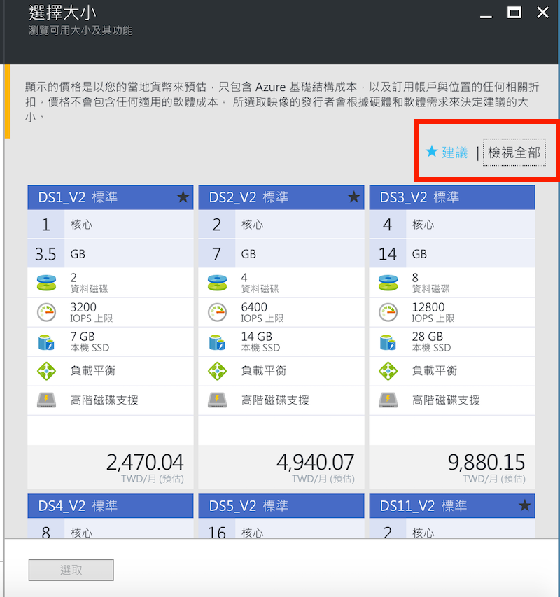

# 從 Web 管理界面建立虛擬機器

這裡我們介紹如何在 Microsoft Azure 的 Web 管理界面建立一台虛擬機器，大部份的設定暫時保留預設選項，這些設定的細節留至其它範例中說明。

## Azure 上虛擬機器映像檔類型

在 Microsoft Azure 上的虛擬機器映像檔因為供應商、軟體授權等方式有不同的類別，分別為：

* **原生作業系統**: 如：Windows Server 2016、Ubunbu Linux 等，這些虛擬機器在使用時只計算虛擬機器本身的使用時間來計費，沒有額外的費用。在這些虛擬機器上安裝的軟體必須自行確認其授權規範。

* **由合作廠商提供及預先安裝軟體的作業系統**: 例如：Red Hat Enterprise Linux、SQL Server Enterprise 等。這些由合作廠商提供原本就需要授權的作業系統、或是預先安裝了需要授權軟體的作業系統，這些除了虛擬機器本身的使用時間之外，也會另外根據使用時間計算軟體授權費，這樣的設計是提供給原本沒有這些軟體授權的狀況下使用。

    > 有些虛擬機器映像檔則需要特定的授權才能使用，像是預先安裝 Visual Studio 的虛擬機器、或是 Windows 10 虛擬機器等需要擁有 Visual Studio 訂閱（原：MSDN 訂閱）的訂用帳戶才能使用。

* **在 Azure Marketplace 中的虛擬機器映像檔**: 這些虛擬機器有些沒有額外的軟體授權費、有些則要按照供應商的授權或購買方式來決定付費的內容。

在 Azure 官網的[虛擬機器價格](https://azure.microsoft.com/zh-tw/pricing/details/virtual-machines/linux/)頁面中，若看到表格中只有一行_價格_的欄位，那就是只計算虛擬機器的使用時間：

如果該虛擬機器映像檔需要額外的軟體授權費，在價格表格中就會多一行_軟體_的欄位，以 Red Hat Enterprise Linux 為例：

> 這些軟體授權費是直接支付給供應商，所以由微軟提供的 Azure 優惠（如：Visual Studio 訂閱或 BizSpark 等）無法包含這部份的費用，需額外支付（會統一在 Azure 帳單中）。

## 在 Web 管理界面的操作

1. 進入 Azure 的 Web 管理界面後，點擊左上角的 **+ (新增)** ，這裡可以直接使用 _搜尋 Marketplace_ 搜尋要使用的虛擬機器作業系統（如：Ubuntu Linux），或者從 _計算_ 的類別尋找合適的虛擬機器。

    > 這裡是選**作業系統**而不是有一個**虛擬機器**的服務，比方說要裝 Windows Server 就直接選要 _Windows Server 2012 R2_ 還是 _Windows Server 2016 Datacenter_ 等；Linux Server 就選 _Ubuntu Linux 16.04 LTS_ 或 _CoreOS Linux (Stable)_ 等。

    選定好要建立的虛擬機器後，就保留預設的以 _Resource Manager_ 做為部署模型按下建立。

2. 首先設定虛擬機器的基本資料：

    * **名稱** 主要是讓你識別這個虛擬機器是做什麼，與它的網域名稱沒有關係。

    * **VM 磁碟類型** 主要是設定虛擬機器的作業系統磁碟是用傳統硬碟 (HDD) 還是固態硬碟 (SSD)，這除了會影響你能選擇的虛擬機器大小類型之外，往後要掛載新的磁碟機時，_只有使用固態硬碟的虛擬機器能掛固態硬碟的磁碟機_。

    * **使用者名稱** 及 **密碼**（或是 **SSH 公開金鑰**）的設定是當虛擬機器完成建立後，預設建立在系統內的帳號，你就能使用它，透過 RDP (Windows Server) 或 SSH (Linux) 連線進入管理虛擬機器。

    * **訂用帳戶** 就是選定這個虛擬機器的費用要計算在哪個帳單下。

    * **資源群組** 你可以選擇要把這個虛擬機器以及一併建立的資源放在哪個群組下，如果沒有群組，你可以直接建立一個新的資源群組來管理這些資源。

    * **位置** 就是設定這個虛擬機器要放在哪一座 Azure 的資料中心。

3. 第 2 步驟則是選擇要使用哪一種虛擬機器等級來建立虛擬機器，這個在虛擬機器建立後可以再更改，而 Azure 官網的[價格頁面](https://azure.microsoft.com/zh-tw/pricing/details/virtual-machines/)也有一些不同等級選擇上的建議說明。

    在這個步驟，系統畫面會先顯示 3 個最多人用的規格，這並不表示你只能選這 3 種，可以按下右上角的 **全部** 打開所有能選的機器規格。而每一個規格下的金額是**預估一整個月都用同一等級並且不關機狀況下的累積花費**。

    

    > 待選的虛擬機器規格會跟你選擇的資料中心位置、VM 磁碟類型等因素而有所不同。

4. 接下來是設定一些虛擬機器系統設定：

    * **儲存體** 因為虛擬機器的磁碟機其實是在 Azure Blob 儲存體中建立一個 _分頁 Blob (Page blob)_ 來儲存資料及處理 I/O，所以這個部份就是設定預設產生的系統磁碟要在哪個 Azure 儲存體帳戶中儲存磁碟機的 VHD 檔案。

    * **網路** 這部份會建立一個虛擬網路，然後給這個虛擬機器一個虛擬 IP（可設定虛擬網段），以及一個公有 IP 與防火牆。

    * **擴充功能** 可以選擇要不要在虛擬機器中預先安裝像是防毒、部署工具、Docker 等擴充功能。

    * **高可用性** 這個部份在需要設定 High Availability (HA) 架構時就需要設定它。

    * **監視** 這部份可選擇要不要保留一些診斷資訊。

5. 最後，Azure 會驗證建立虛擬機器的需求是否能在選定的資料中心做部署，如果驗證完成沒有問題，就可以按下建立的按鈕開始部署虛擬機器。

## 連接虛擬機器

### Windows Server 系列

建立好 Windows Server 的虛擬機器後，在虛擬機器的管理面板上可以點擊**連接**來下載 Remote Desktop 所使用的 RDP 檔案進行連線。不過要注意的是，若在建立虛擬機器時建立的帳號名稱是 `abcd`，在 RDP 連線時名稱要輸入 `\abcd`，以免覺得奇怪為何無法登入。

> 因為機器還沒加入網域，所以加上 `\` 來表示用本機帳號登入。

### Linux 系列

一般建立好的 Linux 伺服器都是用 SSH 連線進去進行管理，你可以在虛擬機器的管理面板上找到該機器的公有 IP 位址，再透過這個 IP 位址連線即可。

## 常見問題