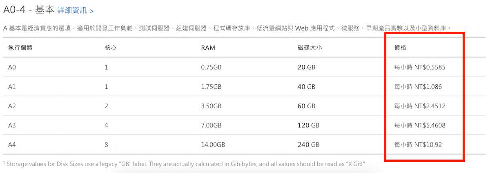
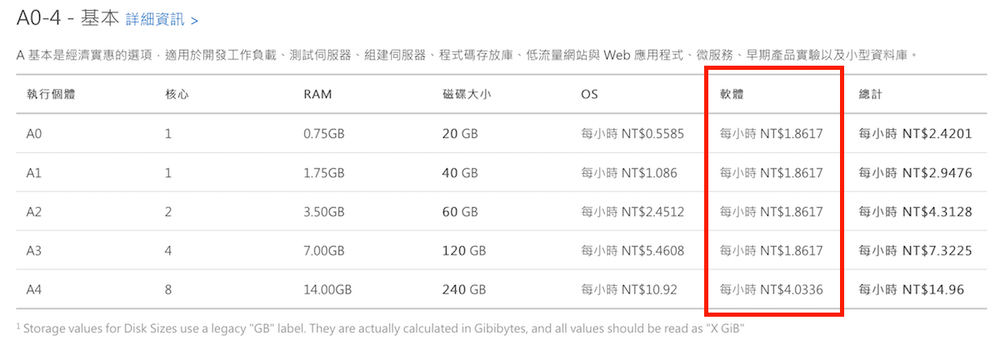

# 從 Web 管理界面建立虛擬機器

這裡我們介紹如何在 Microsoft Azure 的 Web 管理界面建立一台虛擬機器，大部份的設定暫時保留預設選項，這些設定的細節留至其它範例中說明。

## Azure 上虛擬機器映像檔類型

在 Microsoft Azure 上的虛擬機器映像檔因為供應商、軟體授權等方式有不同的類別，分別為：

* **原生作業系統**: 如：Windows Server 2016、Ubunbu Linux 等，這些虛擬機器在使用時只計算虛擬機器本身的使用時間來計費，沒有額外的費用。在這些虛擬機器上安裝的軟體必須自行確認其授權規範。

* **由合作廠商提供及預先安裝軟體的作業系統**: 例如：Red Hat Enterprise Linux、SQL Server Enterprise 等。這些由合作廠商提供原本就需要授權的作業系統、或是預先安裝了需要授權軟體的作業系統，這些除了虛擬機器本身的使用時間之外，也會另外根據使用時間計算軟體授權費，這樣的設計是提供給原本沒有這些軟體授權的狀況下使用。

    > 有些虛擬機器映像檔則需要特定的授權才能使用，像是預先安裝 Visual Studio 的虛擬機器、或是 Windows 10 虛擬機器等需要擁有 Visual Studio 訂閱（原：MSDN 訂閱）的訂用帳戶才能使用。

* **在 Azure Marketplace 中的虛擬機器映像檔**: 這些虛擬機器有些沒有額外的軟體授權費、有些則要按照供應商的授權或購買方式來決定付費的內容。

在 Azure 官網的[虛擬機器價格](https://azure.microsoft.com/zh-tw/pricing/details/virtual-machines/linux/)頁面中，若看到表格中只有一行_價格_的欄位，那就是只計算虛擬機器的使用時間：

如果該虛擬機器映像檔需要額外的軟體授權費，在價格表格中就會多一行_軟體_的欄位，以 Red Hat Enterprise Linux 為例：

> 這些軟體授權費是直接支付給供應商，所以由微軟提供的 Azure 優惠（如：Visual Studio 訂閱或 BizSpark 等）無法包含這部份的費用，需額外支付（會統一在 Azure 帳單中）。

## 在 Web 管理界面的操作

1. 進入 Azure 的 Web 管理界面後，點擊左上角的 **+ (新增)** ，這裡可以直接使用 _搜尋 Marketplace_ 搜尋要使用的虛擬機器作業系統（如：Ubuntu Linux），或者從 _計算_ 的類別尋找合適的虛擬機器。

2. 