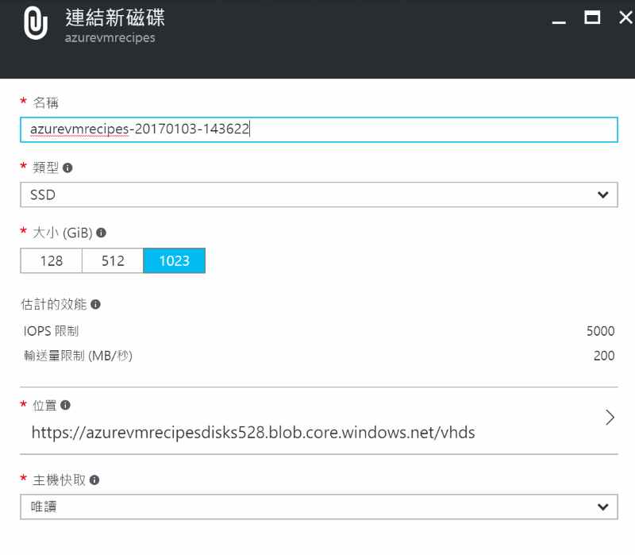

# 掛載新的磁碟機

_作者: Eric ShangKuan @ericsk_

當虛擬機器建立完成後，預設會掛載一顆作業系統用的磁碟機（例如 Windows Server 下的 _C 磁碟機_、Linux 下的 _/dev/sda_），雖然你會看到還有另一顆磁碟機，不過那是暫存磁碟機，資料在機器重開後會消失，所以，除了作業系統的磁碟機之外，若要將資料永久儲存下來，就必須掛載新的磁碟機到虛擬機器上來儲存。

## 從 Web 管理界面掛載新磁碟機

1. 打開虛擬機器的管理面板，點選**磁碟**設定，可以看到目前虛擬機器掛載的磁碟機。

    

2. 點擊面板上方的**連結新項目**，就會開啟另外一個面板來建一顆新磁碟機，產生磁碟機有幾個選項：

    * **名稱**: 用來識別這顆磁碟機的名字，也是會在 Azure 儲存體產生的 _分頁 blob (page blob)_ 的名稱。

    * **類型**: 選擇磁碟機要使用 _HDD (傳統硬碟)_ 或是 _SSD (固態硬碟)_ ，這會影響價格與效能。下方 _估計的效能_ 區域就會提示效能指標。

    * **大小 (GiB)**: 目前 Azure 儲存體的單一分頁 blob 的大小上限是 1TB，所以目前最高能選擇的就是 1,023 GiB 

        > 如果需要更多空間，可以掛載多顆磁碟或是修改程式架構不直接讀寫磁碟機。

    * **位置**: 這裡要選擇這個磁碟機要放在哪個 Azure 儲存體的哪個容器下。

    * **主機快取**: 設定是否要做快取，並且選擇要做哪一種快取。

    

    按下確定後，Azure 就會為你產生一個分頁 blob 來做為磁碟機，並且掛載到虛擬機器上。

3. 掛載新的磁碟機時，它就像是一顆新買的磁碟機一樣，也許你要在系統中進行磁碟分割或檔案系統格式化 (fdisk/format) 後才能使用。

## 使用命令列工具操作

在掛磁碟機到虛擬機器前，我們先在 Azure 儲存體中產生一個用來做磁碟機的**分頁 Blob**，然後就掛載到虛擬機器上。

> 這些指令會根據你的作業系統磁碟來選擇 HDD/SSD。

* Azure XPlat CLI (0.x)

    ```
    azure vm disk attach-new AzureVMRecipes azurevmrecipes 128
    ```

    > 在 _AzureRMRecipes_ 資源群組中的 _azurevmrecipes_ 虛擬機器掛載一顆 (新建) _128GB_ 的磁碟機 

* Azure CLI (new)

    ```
    az vm disk attach-new --resource-group AzureVMRecipes --vm-name azurevmrecipes --vhd https://儲存體帳號.blob.core.windows.net/vhds/d1.vhd --disk-size 128
    ```

    > 在 _AzureRMRecipes_ 資源群組中的 _azurevmrecipes_ 虛擬機器掛載一顆 (新建) _128GB_ 的磁碟機，並且放在 https://儲存體帳號.blob.core.windows.net/vhds/ 下建立一個 _d1.vhd_ 的分頁 blob。

## 常見問題

* 磁碟機的費用就依照 Azure 儲存體服務的分頁 blob 計算。
* 虛擬機器能掛載磁碟機的數量依機器等級有所不同。