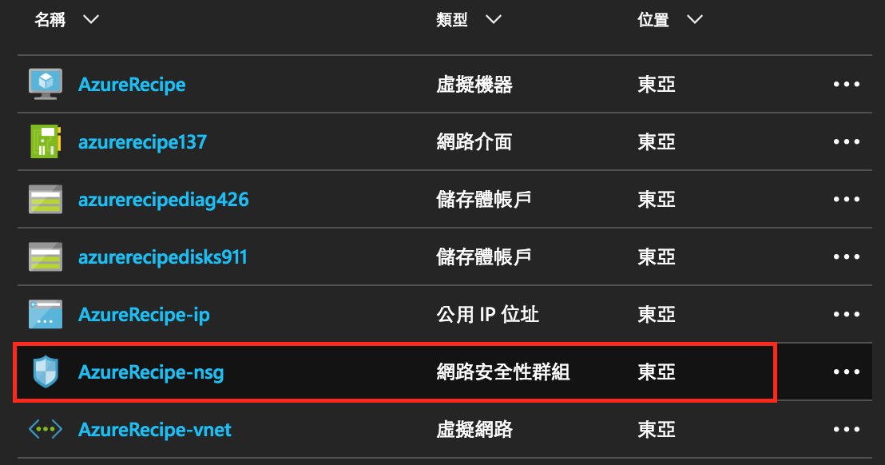
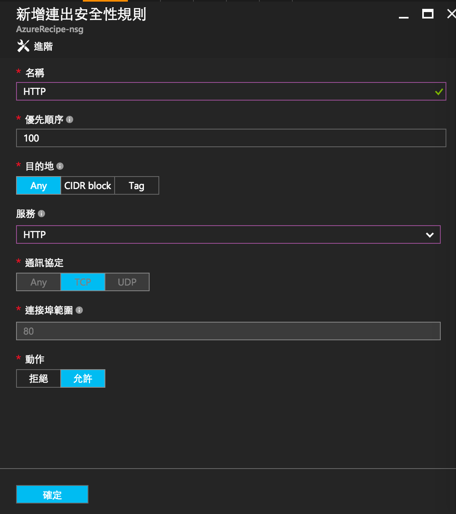
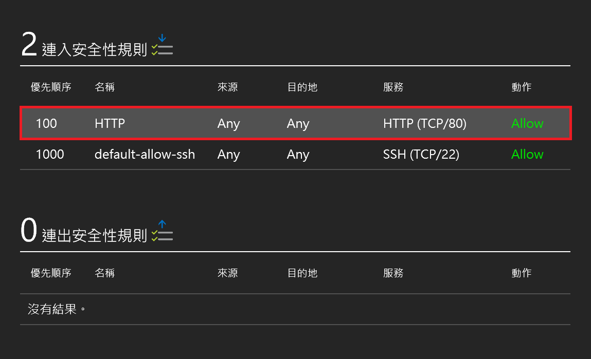

#連接埠設定
這裡介紹如何設定虛擬機器的連接埠 (port)，方便管理虛擬機器連入聯出的規則，或是讓其他電腦可以連結到虛擬機器上來架設的網頁服務。

##操作步驟 - 透過Web管理介面
1.	從建立的資源群組下找到虛擬機器所使用的 _網路安全性群組 (Nework security group)_ ；或是從虛擬機器管理面板點選 _網路介面(Network Interface)_ 一樣可以找到 _網路安全性群組 (Nework security group)_。
	
2. _網路安全性群組_ 的管理面板可以看到連入/連出安全性規則，剛建立好的虛擬機器通常只會開放 SSH 用的 port 22，點選設定 → _連出安全性規則(Outbound)_ → 新增。
3. 接著設定安全性規則基本資料，這邊以新增 HTTP(port 80) 連線為例。
 * **名稱** 規則的名稱	，
 * **優先順序** 100到4096間的數字，數字越小優先順序越高/規則約先被採用，通常會在優先順序中保留間距，方便之後新的規則加入。
 * **目的地** 選擇特定的目的地 IP，可以是不選擇(Any)、CIDR 定義目的地IP範圍，或是標籤選擇目的地(Internet、Virtual Network、LoadBalancer)
 * **服務** 可以選擇預先定義好的服務(例如:SSH、HTTP)，或是選擇自訂，自行設定下方**通訊協定**及**連接埠範圍**。
 * **通訊協定** TCP、UDP 或 Any
 * **連接埠範圍** 單一port(如:80)、連接埠範圍(1-65535)、或是所有連接埠(*)
 * **動作** 允許或是拒絕連線
 	
 4. 回到 _網路安全性群組_ 概觀可以看到新增的安全性規則。
   	

##操作步驟 - 透過Azure CLI
T.B.A.

##參考資源
- https://docs.microsoft.com/zh-tw/azure/virtual-network/virtual-networks-nsg

