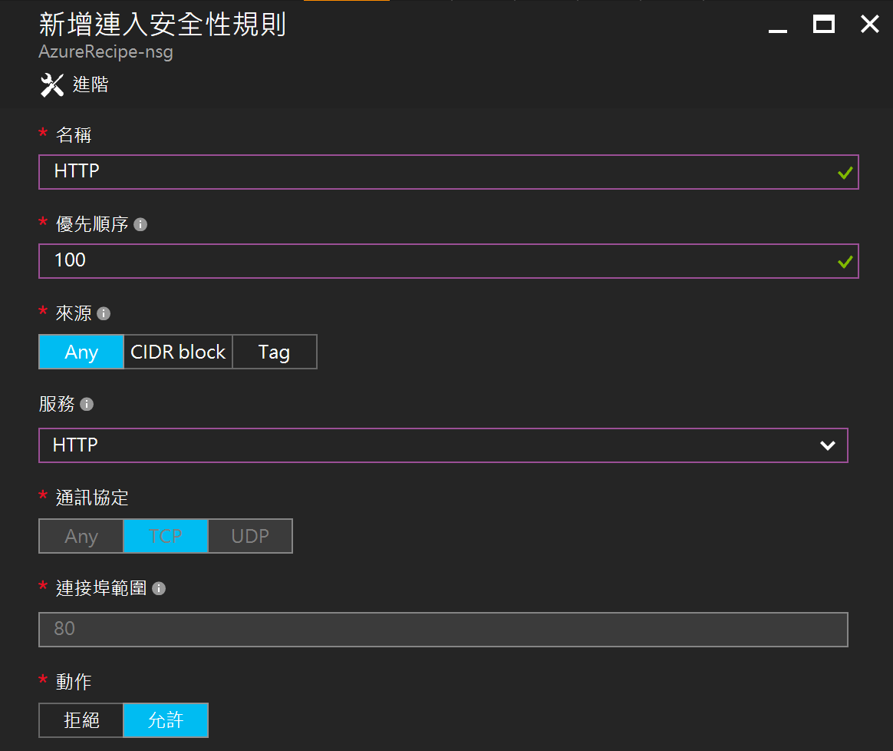
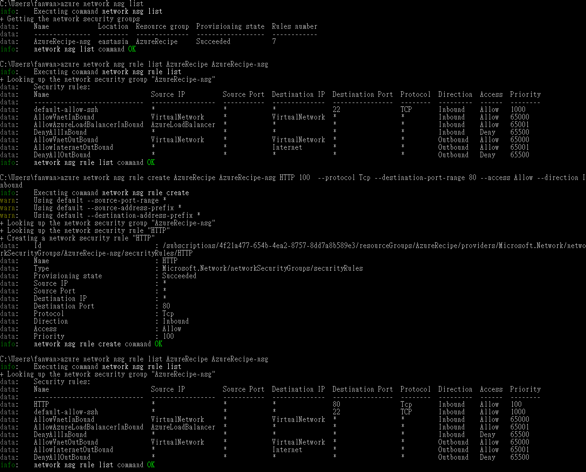

# 連接埠設定

_作者: James Wang @zxcand_

介紹如何設定虛擬機器的連接埠 (port)，管理虛擬機器連入連出的規則，限制虛擬機器對外網路或是讓其他電腦可以連結到虛擬機器上來架設的服務。

## 操作步驟 - 透過Web管理介面

1.	從建立的資源群組下找到虛擬機器所使用的 _網路安全性群組 (Nework security group)_ ；或是從虛擬機器管理面板點選 _網路介面(Network Interface)_ 一樣可以找到 _網路安全性群組 (Nework security group)_。

	

2. _網路安全性群組_ 的管理面板可以看到連入/連出安全性規則，剛建立好的虛擬機器預設只開放 SSH 用的 port 22，點選設定 → _連出安全性規則(Outbound)_ → 新增。

3. 接著設定安全性規則基本資料，這邊以新增 HTTP(port 80) 連線為例。

 * **名稱** 規則的名稱	，

 * **優先順序** 100到4096間的數字，數字越小優先順序越高/規則越優先被採用，通常會在優先順序中保留間距，方便之後新的規則加入。

 * **目的地** 選擇特定的目的地 IP，可以是不選擇(Any)、CIDR 定義目的地IP範圍，或是標籤選擇目的地(Internet、Virtual Network、LoadBalancer)

 * **服務** 可以選擇預先定義好的服務(例如:SSH、HTTP)，或是選擇自訂，自行設定下方**通訊協定**及**連接埠範圍**。

 * **通訊協定** TCP、UDP 或 Any

 * **連接埠範圍** 單一port(如:80)、連接埠範圍(1-65535)、或是所有連接埠(*)

 * **動作** 允許或是拒絕連線

 	

 4. 回到 _網路安全性群組_ 概觀可以看到新增的安全性規則。

   	

## 操作步驟 - 透過Azure CLI

* **Azure XPlat CLI (0.x)**
	
	```
	#列出網路安全性群組
	azure network nsg list [resource-group]

	#列出網路安全性群組下的安全性規則
	azure network nsg rule list <resource-group> <nsg-name>
	
	#新增安全性群組
	azure network nsg create <resource-group> <name> <location>

	#新增安全性規則於安全性群組
	azure network nsg rule create <resource-group> <nsg-name> <name> <priority>
	  --protocol [*, Tcp, Udp]
	  --source-port-range
	  --destination-port-range
	  --access [Allow, Deny]
	  --direction  [Inbound, Outbound]
	```
	
	以新增HTTP port 80連入規則為例:
	```
	azure network nsg list

	azure network nsg rule list AzureRecipe AzureRecipe-nsg

	azure network nsg rule create AzureRecipe AzureRecipe-nsg HTTP 100
	  --protocol Tcp --destination-port-range 80 --access Allow --direction Inbound
	
	azure network nsg rule list AzureRecipe AzureRecipe-nsg
	```

	執行結果如下:

	

* **Azure CLI (new)**
	```
	#列出網路安全性群組
	az network nsg list [resource-group]

	#列出網路安全性群組下的安全性規則
	az network nsg create --resource-group myResourceGroup --location westus \
    --name myNetworkSecurityGroup
	
	#新增安全性規則
	az network nsg rule create --resource-group myResourceGroup \
    --nsg-name myNetworkSecurityGroup --name myNetworkSecurityGroupRule \
    --protocol tcp --direction inbound --priority 1000 \
    --source-address-prefix '*' --source-port-range '*' \
    --destination-address-prefix '*' --destination-port-range 80 --access allow

	#更新網路介面
	az network nic update --resource-group myResourceGroup --name myNic \
    --network-security-group myNetworkSecurityGroup
	```
	
## 參考資源

- [Azure 網路安全性群組](https://docs.microsoft.com/zh-tw/azure/virtual-network/virtual-networks-nsg)

- [Azure CLI 開啟連接埠及端點快速命令](https://docs.microsoft.com/zh-tw/azure/virtual-machines/virtual-machines-linux-nsg-quickstart)

- [從範本建立網路安全性群組](https://docs.microsoft.com/zh-tw/azure/virtual-network/virtual-networks-create-nsg-arm-template)