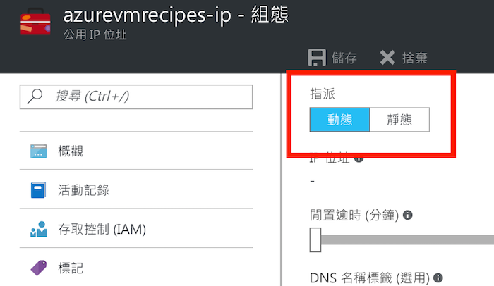

# 保留固定（靜態）的公用 IP 位址

Microsoft Azure 允許你在同一個機房能免費使用 5 個靜態 IP 位址（第 6 個開始計費，動態 IP 位址則不限），預設情況下建立虛擬機器時一併建立的公用 IP 位址是動態的，如果你希望 IP 位址固定下來，就要把它設為使用靜態 IP 位址。

## 操作步驟

1. 找到虛擬機器綁定的公用 IP 資源，如果不知道是哪一個資源，就在虛擬機器的管理面板裡找到，點擊下去就會跳到公用 IP 位址的資源管理面板。

    

2. 點開 _公用 IP 位址_ 資源的管理面板，在 **組態** 區域中將 **指派** 更改為 _靜態_，接著按下上方的儲存按鈕儲存設定。

    

3. 儲存設定後，下方的 **IP 位址**就是固定的 IP 了。

## 造成的影響

1. IP 位址將會固定下來，不會因為重新開機而變更。
2. 欲變更 IP 位址或重新指派為動態，需先從虛擬機器的**網路介面**取消與這個**公用 IP 位址**資源的關聯，才能更改。