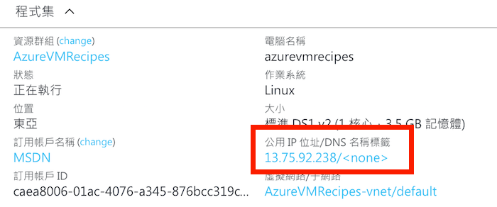
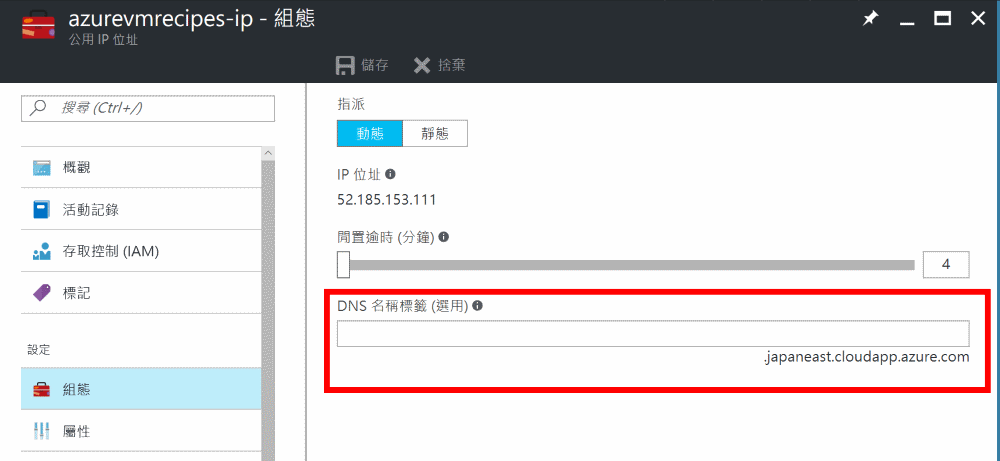

# 為公用 IP 位址設定一個預設的網域名稱

_作者: Eric ShangKuan @ericsk_

在為虛擬機器綁定公用 IP 位址時，Microsoft Azure 允許你為它設定一個像是 `<名稱>.<資料中心位置>.cloudapp.azure.com` 這樣的網域名稱，即時你還沒有個人的網域名稱，也可以用這個名稱對應到機器的 IP 位址，方便記憶。

> 尤其對於 _動態_ 的公用 IP 位址更方便，IP 位址換了也會更新對應。

## 透過 Web 管理界面設定

1. 找到虛擬機器綁定的公用 IP 資源，如果不知道是哪一個資源，就在虛擬機器的管理面板裡找到，點擊下去就會跳到公用 IP 位址的資源管理面板。

    

2. 點開 _公用 IP 位址_ 資源的管理面板，在 **組態** 區域中將 **DNS 名稱標籤** 欄位填入想要設定的名稱，如果沒有重複使用，按下儲存就可以生效了。

    

    以上圖為例，因為這個 IP 位址是在 Azure 的日本東部機房取用的，所以網域名稱就會是 `*.japaneast.cloudapp.azure.com`。

## 透過命令列工具來操作

* Azure XPlat CLI (0.x)

    ```
    azure network public-ip set --resource-group AzureVMRecipes --name azurevmrecipes-ip --domain-name-label myawesomevm
    ```

* Azure CLI (new)

    ```
    az network public-ip update --name azurevmrecipes-ip --resource-group AzureVMRecipes --dns-name myawesomevm
    ```

如此一來你就會設定了一個 `myawesomevm.<機房位置>.cloudapp.azure.com` 的網域名稱，也就能直接透過它來連線。