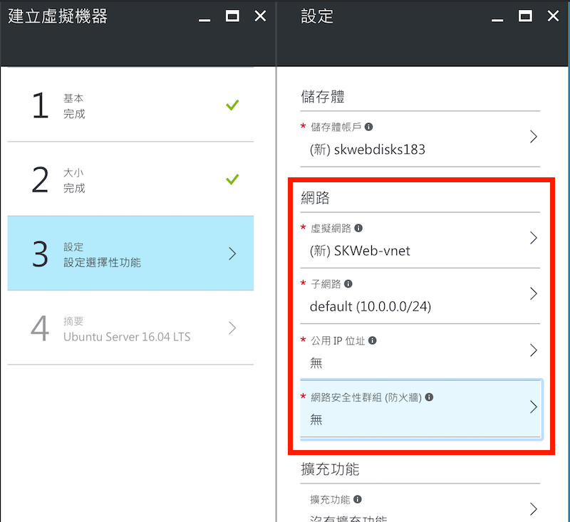
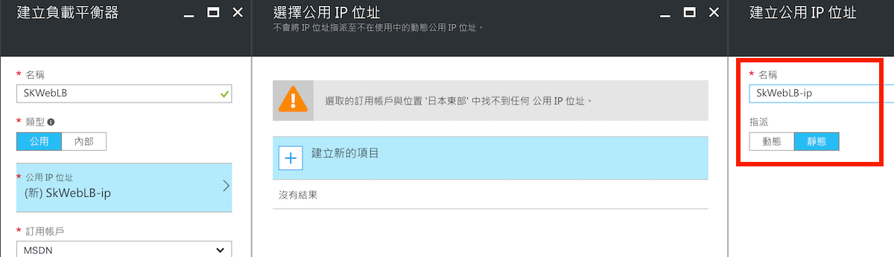
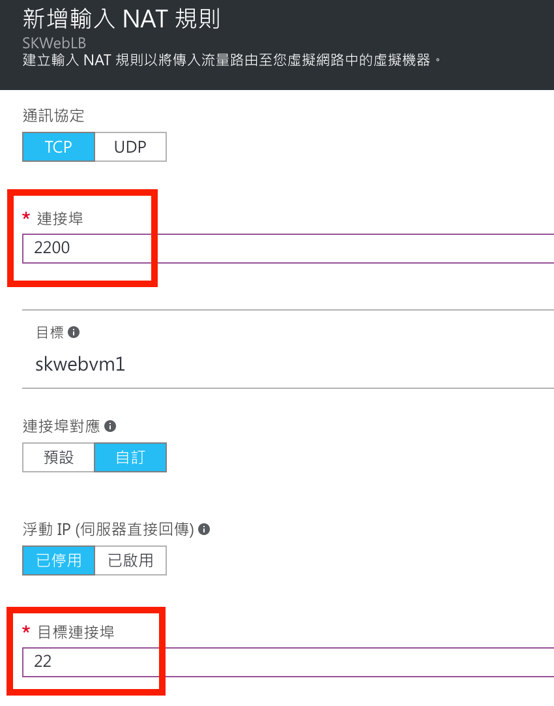
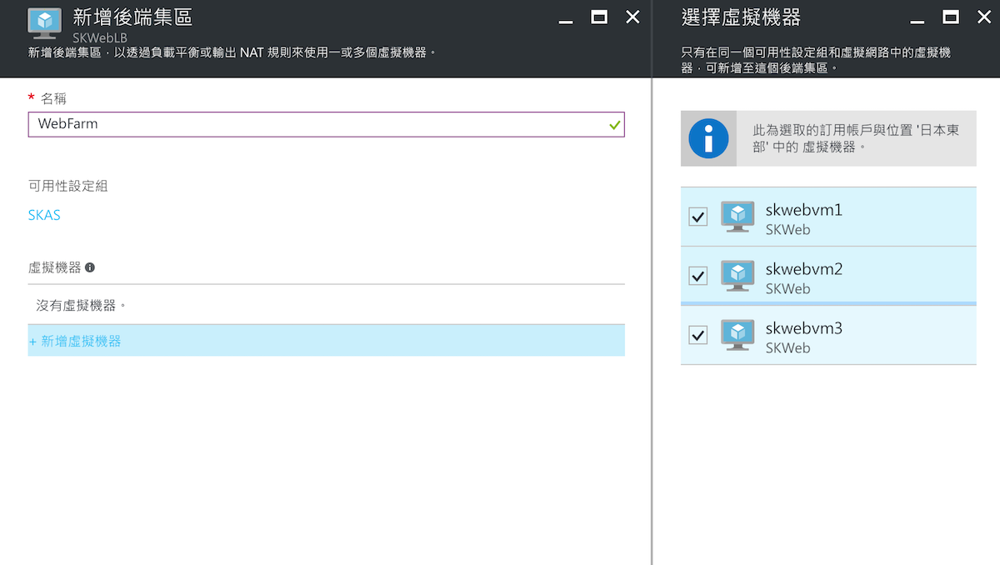
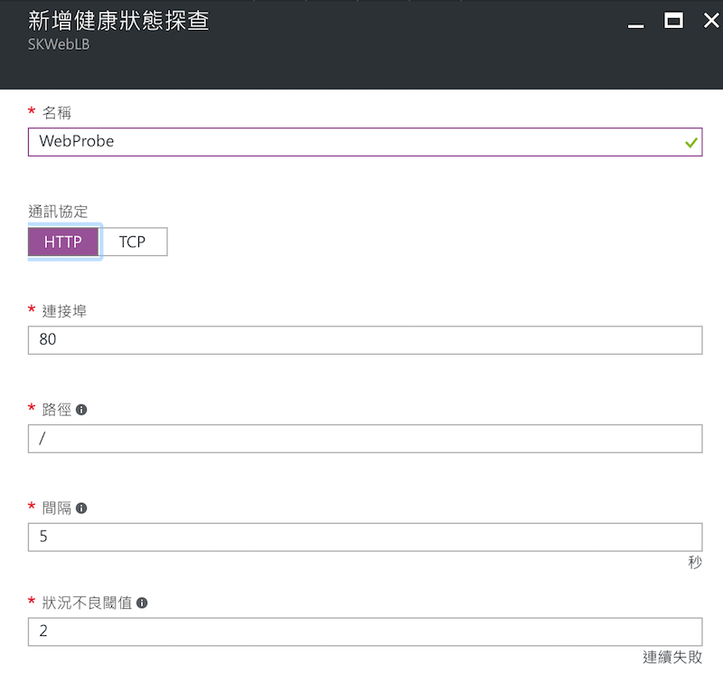
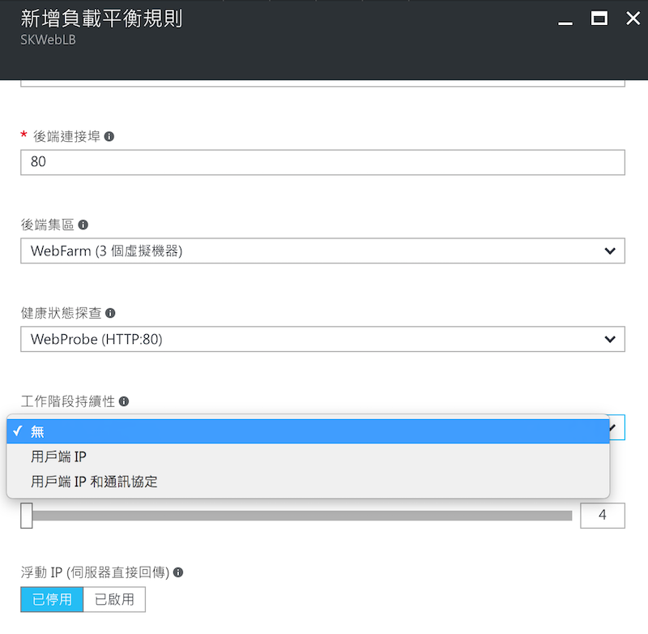

# 使用負載平衡器分散流量到不同的虛擬機器

當服務的使用量上升時，也許會考量使用多台虛擬機器來提供服務，但不需要讓使用者自己選擇要連哪一台虛擬機器來取得服務，最好是所有使用者有個單一入口，然後自動被分配到不同的虛擬機器上運作，在 Azure 上可以使用免費的負載平衡器（Load Balancer）來做到這樣的需求。

這裡我們以 Web 伺服器為例，建立 3 台虛擬機器來分散存取網站的流量。

## 建立提供服務的虛擬機器

在同一個資源群組下建立三個虛擬機器，因為是在同一個資源群組下，預設會建立一個虛擬網路並且把這三台機器都放在這個虛擬網路下，這樣一來這三台虛擬機器就會在同一個區域網路中彼此可以互連，而建立時，也可以把公用 IP 位址以及網路安全性群組設成**無**，讓這三台機器不會曝露在公開的網路環境中。



同時**也要把這三台虛擬機器放在同一個可用性集（availability set）中**，建立好的三台虛擬機器可能會像是這樣：


> 關於可用性集的設定可以參考 [運用可用性集建立高穩定（HA）架構](/ch04/high-availability-service-architecture-via-availability-set.md)


## 設定負載平衡

### 建立負載平衡器

直接從新增資源中新增一個負載平衡器到資源群組中，**類型**選擇 _公用 (public)_，然後在**公用 IP 位址**處新增一個公用 IP 位址的資源（也可以選擇已經建立的），然後設定這個 IP 為靜態的 IP。



然後資源群組與位置就設定與之前建立的虛擬機器相同，按下 **確定** 開始建立負載平衡器。

### 設定 NAT 規則以連線至虛擬機器

由於先前建立的虛擬機器沒有設定公用 IP 位址（也可以說是為了這個食譜故意不設公用 IP 位址），所以也沒有辦法直接連線到這些機器來安裝軟體或設定服務等。不過在 Azure 上建立的虛擬機器，Windows Server 會預設開 RDP 而 Linux 會開 SSH 服務，這時只要在已經綁了公用 IP 位址的負載平衡器上設定 NAT 規則對應就可以了。

首先在負載平衡器的管理頁面中選擇 **NAT 規則**然後新增一筆規則，這裡的範例是將公用 IP 的 _2200_ 連接埠對應到第一台虛擬機器的連接埠 22。



新增完 NAT 規則後，便能透過這唯一的公用 IP 位址，透過 2200 連接埠連接到 vm1。至於其它虛擬機器要透過這台 vm1 再連接還是要如法炮製新增多個 NAT 規則都可以。

### 在虛擬機器裡安裝 Web 伺服器

能連線到這些虛擬機器後，可以在上面啟動或安裝 Web 伺服器，以 Ubuntu Linux 為例，可以簡單安裝 nginx 來測試負載平衡器是否有正常工作。

安裝及啟動指令如下：
```
$ sudo apt install nginx
...
...
$ sudo service nginx start
```

然後修改 `/var/www/html/` 下的 index 檔案，可以測試負載平衡器是否有跳到不同的機器。

### 設定後端集區

為了讓負載平衡器知道它有哪些機器可以分散流量，所以要先在負載平衡器上設定後端集區，所以你可以選擇要分散流量的虛擬機器進入集區。



### 建立健康狀態探查

雖然已經知道有哪些虛擬機器可以用來分散流量，但虛擬機器可能有意外無法正常提供服務，負載平衡器不能把流量導向那些有問題的機器，所以需要一個探查後端集區虛擬機器的動作來確認哪些機器還能正常提供服務。

在負載平衡器的管理頁面中，進入**健康狀態探查**的區域，新增一個健康探查。



以 Web 服務為例，可以建立一個 **HTTP** 的探查，然後指定後端虛擬機器的連接埠，以及確認健康狀態的細節。

### 建立負載平衡規則

前面的動作都準備完成後，還要建立負載平衡規則才會真的啟動負載平衡，在負載平衡器的管理頁面中，進入**負載平衡規則**的區域，新增一個規則。



在規則設定中，大部份的選項都很白話，比較特別是在 **工作階段持續性** 的部份，雖然負載平衡器會分散流量到後端集區中的任何一台虛擬機器，但如果在這個屬性設定了 _用戶端 IP_ 後，就會根據用戶端的 IP 位址固定在同一台虛擬機器，這裡可以根據需要進行設定。

> 固定用戶在同一台機器雖然方便處理 session 或 state 等運作，但另一方面也降低了平衡的彈性。

完成設定後，用戶連接負載平衡器的公用 IP 位址時，負載平衡器就會分配用戶到不同的虛擬機器上。