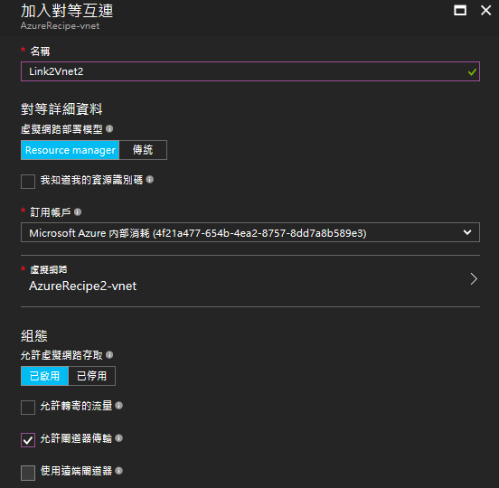
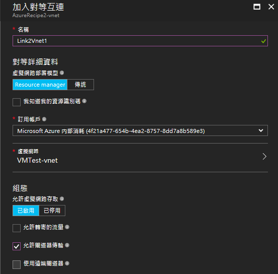

# 建立虛擬網路對等互連 (VNet peering)

當需要在不同的虛擬網路間進行通訊，我們可以透過對等互連 (peering) 的方法將同地區的兩個虛擬網路相連，可以如同在同個虛擬網路透過 private IP 互相溝通，減少虛擬網路間頻寬的限制。

連結的虛擬網路可以跨不同訂閱帳戶，但必須符合以下條件:
- 必須在相同機房區域
- 必須有非重疊的子網路IP位址空間

另外，虛擬網路的互連沒有遞移律，也就是說，虛擬網路VNetA與VNetB互連，VNetB和VNetC互連，並不代表VNetA及VNet_C相連。
而每個虛擬網路預設對等互連的數目限制是10個，透過Azure支援服務增加數目(上限50個)。

## 透過 Web 管理界面的操作
若我們想要互連兩個虛擬網路: VNet1及VNet2
1. 在 VNet1 的**設定**->找到**對等(Peerings)**->**新增**，設定對等連接名稱以及要連接的虛擬網路，
    
    

    新增完畢後，可以看到互連狀態為**已起始(Intiated)**

2. 接著，同樣在 VNet2 的**設定**->找到**對等互連(Peerings)**->**新增**，設定對等連接名稱及虛擬網路

    

    新增完畢後，兩邊虛擬網路的互連狀態都會改成**已連接(Connected)**。

    


## 透過 PowerShell 命令列工具操作
1. 先找到要相連的兩個虛擬網路
    ```
    $vnet1 = Get-AzureRmVirtualNetwork -ResourceGroupName AzureRecipe -Name AzureRecipe-vnet
    $vnet2 = Get-AzureRmVirtualNetwork -ResourceGroupName AzureRecipe2 -Name AzureRecipe2-vnet
    ```
    
2. 分別新增對等連線

    (若兩個虛擬網路是在不同的訂閱帳號之下，則需要分別登入新增)
    ```
    Add-AzureRmVirtualNetworkPeering -Name LinkToVNet2 -VirtualNetwork $vnet1 -RemoteVirtualNetworkId $vnet2.Id
    Add-AzureRmVirtualNetworkPeering -Name LinkToVNet1 -VirtualNetwork $vnet2 -RemoteVirtualNetworkId $vnet1.Id
    ```

3.  透過RemoteVirtualNetwork可以看到連結虛擬網路的Id，檢查對等連線。

    (注意: 即使使用 Get-AzureRmVirtualNetwork $vnet1,$vnet2 裡面的 VirtualNetworkPeerin gs欄位並不會跟著更新)
    
    ```
    $Link2VNet2 = Get-AzureRmVirtualNetworkPeering -VirtualNetworkName AzureRecipe-vnet -ResourceGroupName AzureRecipe -Name LinkToVNet2
    ```

    或是變更參數設定
    - AllowVirtualNetworkAccess : 允許虛擬網路存取
    - AllowForwardedTraffic : 允許對等網路外部流量轉寄
    - AllowGatewayTransit : 允許對等網路使用閘道進行傳輸
    - UseRemoteGateways : 使用遠端閘道
    
    預設值如透過 Web管理界面，除了 AllowVirtualNetworkAccess 預設為true，其他皆預設為false ，例如:
    ```
    Link2Vnet2.AllowFowardedTraffic = $true;
    ```

## 參考資料

- [VNet 對等互連](https://docs.microsoft.com/zh-tw/azure/virtual-network/virtual-network-peering-overview)